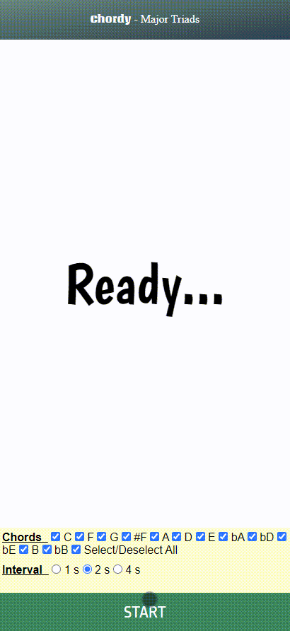

# Chordy
This is a tool for practicing chord progressions for musician. 
You can select chords you want to practice and the play speed. Chords progression will be generated by the script, so you can follow along with your instrument.

## Technical Points
- Vanilla JS for handling user selection inputs: dom element selector, setInterval, array manipulation
- Html layouts: div, p, span, form, label, input, checkbox, onclick

